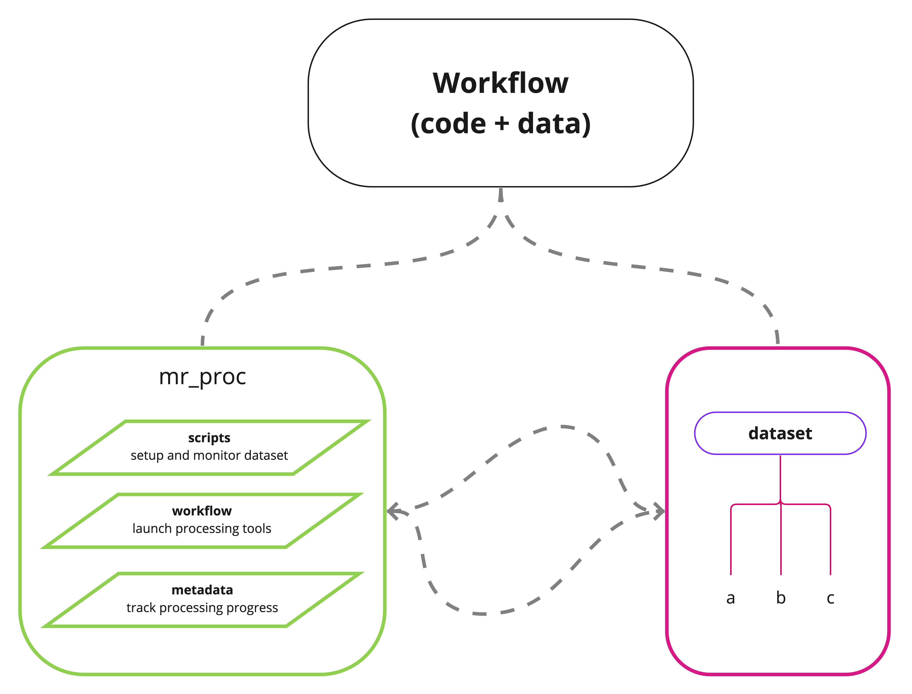
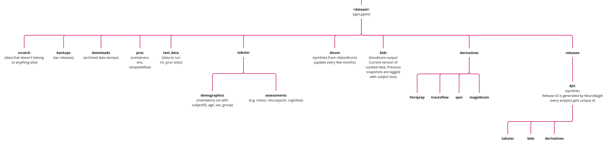

# mr_proc 
A workflow for standarized MR images processing. 
*Process long and prosper.*

## Objective
This repo will contain container recipes and run scripts to manage MR data organization and image processing. Currently, it offers scripts to: 
    1. Standadized data i.e. convert DICOMs into BIDS.
    2. Run commonly used image processing pipelines e.g. FreeSurfer, fMRIPrep.
    3. Organize processed MR data inside `derivatives` directory. 
    4. Organize demographic and clinical assessment data inside `tabular` directory. 
    5. Provide metadata to `NeuroBagel` to allow indexing and query participants across multiple studies.
    
The scripts in mr_proc operate on a dataset directory with a specific subdir tree structure.

The organization mr_proc code module is as follows:
   - global_config: A file to set various paths specific to the machine you are using which will be used for data processing. 
   - scripts: helper code to setup and check status of mr_proc
   - workflow: code modules to exectute mr_proc stages and logging
   - metadata: files to track mr_proc progress

## General Notes
   - The mr_proc setup uses Singualrity containers to run various MR image processing pipelines. Once the container is created/downloaded, you can write a python or shell run script and save them inside [my_new_pipeline](/workflow/proc_pipe/)
   - The mr_proc setup allows you to validate processed output for 1) BIDS conversion 2) FreeSurfer 3) fMRIPrep and reports failed participants.

## Workflow steps

### 0. Setup dataset directory structure
   - mr_proc expects following directory tree with several *mandatory* subdirs and files. 
   - You can run `scripts/mr_proc_setup.sh` to create this directory tree. 
   - You can run `scripts/mr_proc_stutus.sh` check status of your dataset

### 1. Create subject manifest
   - Update the `mr_proc_manifest.csv` in `<DATASET_ROOT>/tabular/demographics` comprising at least `participant_id`,`age`,`sex`,`group` (typically a diagnosis) columns.  
       - This list serves as a ground truth for subject availability and participant IDs are used to create BIDS ids downstream.
       
### 2. Gather MRI acquisition protocols (Optional)
   - List all the modalities and acquisition protocols used duing scanning e.g. MPRAGE, 3DT1, FLAIR, RS-FMRI etc. in the `mr_proc/workflow/dicom_org/scan_protocols.csv`
   - Although optional this is an important documentation for comparing across studies. 
   
### 3. Organize (and rename) DICOMs 
   - Scanner DICOM files are named and stored in various formats and locations. In this step we extract, copy, and rename DICOMs in a single directory for all participants with available imaging data. 
       - Copy / download all "raw dicoms" in the `<DATASET_ROOT>/scratch/raw_dicoms` directory.
       - Write a script to extract, copy, and rename these raw DICOMs into `<dataset>/dicom`. Ensure `participant_id` naming matches with `participants.csv` in `<DATASET_ROOT>/tabular/demographics` 
   - Copy a single participant (i.e. dicom dir) into `<DATASET_ROOT>/test_data/dicom`. This participant will serve as a test case for various pipelines. 
   
### 4. Populate [global configs](`<DATASET_ROOT>/proc/global_configs.json`) file
   - This file contains paths to dataset, pipeline versions, and containers used by several workflow scripts.
   - This is a dataset specific file and needs to be modified based on local configs and paths.

### 5. Run DICOM --> BIDS conversion using [Heudiconv](https://heudiconv.readthedocs.io/en/latest/) ([tutorial](https://neuroimaging-core-docs.readthedocs.io/en/latest/pages/heudiconv.html))
   - Make sure you have the appropriate HeuDiConv container in your [global configs](./workflow/global_configs.json)
   - Use [run_bids_conv.py](workflow/bids_conv/run_bids_conv.py) to run HeuDiConv `stage_1` and `stage_2`.  
      - Run `stage_1` to generate a list of available protocols from the DICOM header. These protocols are listed in `<DATASET_ROOT>/bids/.heudiconv/<participant_id>/info/dicominfo_ses-<session_id>.tsv`
      - Example command:
         - python run_bids_conv.py --global_config ../global_configs.json --participant_id MNI01 --session_id 01 --stage 1

      - Copy+Rename [sample heuristic file](workflow/bids_conv/sample_heuristic.py) --> `./heuristic.py` to create a name-mapping (i.e. dictionary) for bids organization based on the list of available protocols. **Note that this file automatically gets copied into `$DATASET_ROOT/proc/heuristic.py` to be seen by the Singularity container.**
      - Run `stage_2` to convert the dicoms into BIDS format based on the mapping from `heuristic.py`. 
      - Example command:
         - python run_bids_conv.py --global_config ../global_configs.json --participant_id MNI01 --session_id 01 --stage 2

       - The above scripts are written to work on a single participant. The entire dataset can be BIDSified using a "for loop" or if you have access to a cluster you can run it parallel using queue submission [scripts](workflow/bids_conv/scripts/hpc/)
       - If you are doing this for the first time, you should first try [run_bids_conv.py](workflow/bids_conv/run_bids_conv.py) in a `test mode` by following these steps:
            - Copy a single participant directory from `<DATASET_ROOT>/dicom` to `<DATASET_ROOT>/test_data/dicom` 
            - Run `stage_1` and `stage_2` with [run_bids_conv.py](workflow/bids_conv/run_bids_conv.py) with additional `--test_run` flag. 

### 6. Run BIDS validator
   - Make sure you have the appropriate HeuDiConv container in your [global configs](./workflow/global_configs.json)
   - Use [run_bids_val.sh](workflow/bids_conv/scripts/run_bids_val.sh) to check for errors and warnings
        - Sample command: `run_bids_val.sh <bids_dir> <log_dir>` 
        - Alternatively if your machine has a browser you can also use an online [validator](https://bids-standard.github.io/bids-validator/)
   - Note that Heudiconv is not perfect! Common issues:
       - Make sure you match the version of Heudiconv and BIDS validator standard. 
       - Heuristic file will also need to be updated if your dataset has different protocols for different participants. 
       - You should also open an issue on this repo with the problems and solutions you encounter during processing. 

### 7. Fix HeuDiConv errors
   - If you see errors from BIDS validator, it is possible that HeuDiConv may not be supporting your MRI sequence. In that case add a function to [fix_heudiconv_issues.py](workflow/bids_conv/fix_heudiconv_issues.py) to manually rename files, and run the script posthoc. 
   - Make sure to open an issue on [HeuDiConv Github](https://github.com/nipy/heudiconv/issues) for fix in future release. 

### 8. Run MR image processing pipelines
Curating dataset into BIDS format simplifies running several commonly used pipelines. Each pipeline follows similar steps:
   - Specify pipeline container (i.e. Singularity image / recipe) 
   - Run single participant test. This uses sample participant from /test_data/bids as input and generates output in the /test_data/<pipeline> dir. 
   - Run entire dataset (provided single participant test is successful)

#### 8.1 [fMRIPrep](https://fmriprep.org/en/stable/) (including FreeSurfer) 
   - Use [run_fmriprep](workflow/proc_pipe/fmriprep/run_fmriprep.py) script to run fmriprep pipeline. 
      - Mandatory: For FreeSurfer tasks, **you need to have a [license.txt](https://surfer.nmr.mgh.harvard.edu/fswiki/License) file inside `<DATASET_ROOT>/derivatives/fmriprep`**
      - Mandatory: fMRIPrep manages brain-template spaces using [TemplateFlow](https://fmriprep.org/en/stable/spaces.html). These templates can be shared across studies and datasets. Use [global configs](./workflow/global_configs.json) to specify path to `TEMPLATEFLOW_DIR` where these templates can reside. For machines with Internet connections, all required templates are automatically downloaded duing the fMRIPrep run. 
      - You can run "anatomical only" workflow by adding `--anat_only` flag
      - Optional: To ignore certain modalities / acquisitions you can create a `bids_filter.json` file. This is common when you have multiple T1w acquisitions (e.g. Neuromelanin, SPIR etc.) in the BIDS directory. See [sample_bids_filter.json](workflow/proc_pipe/fmriprep/sample_bids_filter.json) for an example. **Note that you can create a custom `bids_filter.json` by Copy+Renaming [sample_bids_filter.json](workflow/proc_pipe/fmriprep/sample_bids_filter.json). When `--use_bids_filter` flag is set, this `bids_filter.json` automatically gets copied into `<DATASET_ROOT>/bids/bids_filter.json` to be seen by the Singularity container.** 
      - Similar to HeuDiConv, you can do a test run by adding `--test_run` flag. (Requires a BIDS participant directory inside `<DATASET_ROOT>/test_data/bids`)
   - Example command:
      - python run_fmriprep.py --global_config ../../global_configs.json --participant_id MNI01 --session_id 01 --use_bids_filter
      - You can change default run parameters in the [run_fmriprep.sh](workflow/proc_pipe/fmriprep/scripts/run_fmriprep.sh) by looking at the [documentation](https://fmriprep.org/en/stable/usage.html)

   - Main MR processing tasks run by fmriprep (see [fMRIPrep](https://fmriprep.org/en/stable/) for details):
      - Preprocessing
         - Bias correction / Intensity normalization (N4)
         - Brain extraction (ANTs)
         - Spatial normalization to standard space(s)
      - Anatomical
         - Tissue segmentation (FAST)
         - FreeSurfer recon-all
      - Functional
         - BOLD reference image estimation
         - Head-motion estimation
         - Slice time correction
         - Susceptibility Distortion Correction (SDC)
         - Pre-processed BOLD in native space
         - EPI to T1w registration
         - Resampling BOLD runs onto standard spaces
         - EPI sampled to FreeSurfer surfaces
         - Confounds estimation
         - ICA-AROMA (not run by default)
      - Qualtiy Control
         - [Visual reports](https://fmriprep.org/en/stable/outputs.html#visual-reports)

   - Validate output 
      - You can check successful completion of the fmriprep run by confirming certain output files. The following two scripts will check `freesurfer` and `fmriprep` specific expeteced files independently.
         - [fsvalidator](workflow/proc_pipe/fmriprep/fs_validator.py)
         - [FS validator](workflow/proc_pipe/fmriprep/fmriprep_validator.py)
      - You should also do a Visual QC using reports provided by fmriprep. 
         - Look at the subject specific [html reports](https://fmriprep.org/en/stable/outputs.html#visual-reports)
         - SDC correction [note](https://neurostars.org/t/weird-results-of-performing-susceptibility-distortion-correction-on-the-epi/20352/2): "It is expected that the frontal lobe shrank after SDC correction. Indeed P>A acquisition has a tendency to “inflate” this area, so SDC correction shrank it to its original shape. More importantly, the functional image after SDC should get closer to anatomical outline" 

   - CLEANUP of working dir
      - fmriprep run generates huge number of intermediate files. You should remove those after successful run to free-up space. 
         - e.g. fmriprep_wf/

### TODO
   
#### [MRIQC](https://mriqc.readthedocs.io/en/stable/)

#### [TractoFlow](https://github.com/scilus/tractoflow)

#### [MAGeT Brain](https://github.com/CoBrALab/MAGeTbrain)
