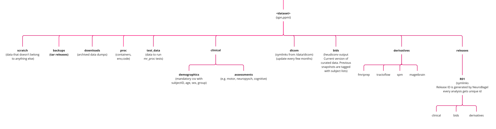

# mr_proc 
A workflow for standarized MR images processing. 
*Process long and prosper.*

## Objective
This repo will contain container recipes and run scripts to manage MR data organization and image processing. Currently, it offers scripts to 
    1. Standadized data i.e. convert DICOMs into BIDS
    2. Run commonly used image processing pipelines e.g. FreeSurfer, fMRIPrep

## Workflow steps

### 0. Setup dataset directory structure
   - mr_proc expects following directory tree with several *mandatory* subdirs and files. 
   - You can run `scripts/mr_proc_setup.sh` to create this directory tree. 
   - You can run `scripts/mr_proc_stutus.sh` check status of your dataset

### 1. Initialize mr_proc tracker
   - This creates proc_tracker.csv comprising participant IDs from participants.csv 
       - This will track the progress of processing workflow and any issues we encounter. 
       
### 2. Gather MRI acquisition protocols
   - List all the modalities and acquisition protocols used duing scanning e.g. MPRAGE, 3DT1, FLAIR, RS-FMRI etc. in the `workflow/dicom_org/scan_protocols.csv`
   
### 3. DICOM organization
   - DICOMs are available in various formats and disks. In this step we extract, copy, and rename DICOMs in a single directory for all participants listed in the metadata.csv. 
   - Participant ID convention is decided in this step during renaming. 
   - Copy a single participant (dicom dir) into test_data/dicom. This participant will serve as a test case for various pipelines. 
   
### 4. BIDS conversion using [Heudiconv](https://heudiconv.readthedocs.io/en/latest/) ([tutorial](https://neuroimaging-core-docs.readthedocs.io/en/latest/pages/heudiconv.html))
   - Specify Heudiconv container (i.e. Singularity image / recipe) 
   - Run single participant tests: 
       - Modify and run "./heudiconv_run1.sh --test-run" with apporpriate local paths for container and project dir. This will generate list of available protocols from DICOM header. This script will use a test participant from test_data/dicom for processing. 
       - Manually update the heurisitic file using the enlisted protocols from run1. 
       - Modify and run "./heudiconv_run2.sh --test-run" script with apporpriate local paths. This will convert the DICOMs into NIFTIs along with sidecar JSONs and organize them based on your heuristic file. The BIDS dataset is created under /test_data/bids. 
       - Run BIDS validator. There are several options listed [here](https://github.com/bids-standard/bids-validator). Make sure you match the version of Heudiconv and BIDS validator standard. 
   - Run entire dataset (provided single participant test is successful) 
       - Modify and run "./heudiconv_run1.sh" and "./heudiconv_run2.sh" without the "--test-run" flag. This will require you to specify your real DICOM and BIDS dir paths. 
       - The above scripts are written to work for single participant (i.e. single DICOM dir). The entire dataset can be BIDSified using a "for loop" or if you have access to a cluster you can run it parallel using heudiconv_run<>_sge.sh or heudiconv_run<>_slurm.sh queue submission scripts. 
       - Heudiconv is not perfect! Heuristic file will also need to be updated if your dataset has different protocols for different participants. Any custom post-hoc changes / fixes your make to BIDS datasets must be added to proc_tracker.csv under "notes" column. 
           - Example issue: heudiconv adds mysterious suffix - possibly due to how dcm2nix handles multi-echo conversion see [neurostar issue](https://neurostars.org/t/heudiconv-adding-unspecified-suffix/21450/3) 
       - Once dataset passes BIDS validation, update proc_tracker.csv with BIDS_status column marked as "complete". 
       
### 5. Run processing pipelines
Curating dataset into BIDS format simplifies running several commonly used pipelines. Each pipeline follows similar steps:
   - Specify pipeline container (i.e. Singularity image / recipe) 
   - Run single participant test. This uses sample participant from /test_data/bids as input and generates output in the /test_data/<pipeline> dir. 
   - Run entire dataset (provided single participant test is successful)

#### [fMRIPrep](https://fmriprep.org/en/stable/) (including FreeSurfer) 

#### [MRIQC](https://mriqc.readthedocs.io/en/stable/)

#### [SPM](https://www.fil.ion.ucl.ac.uk/spm/)

#### [TractoFlow](https://github.com/scilus/tractoflow)

#### [MAGeT Brain](https://github.com/CoBrALab/MAGeTbrain)
