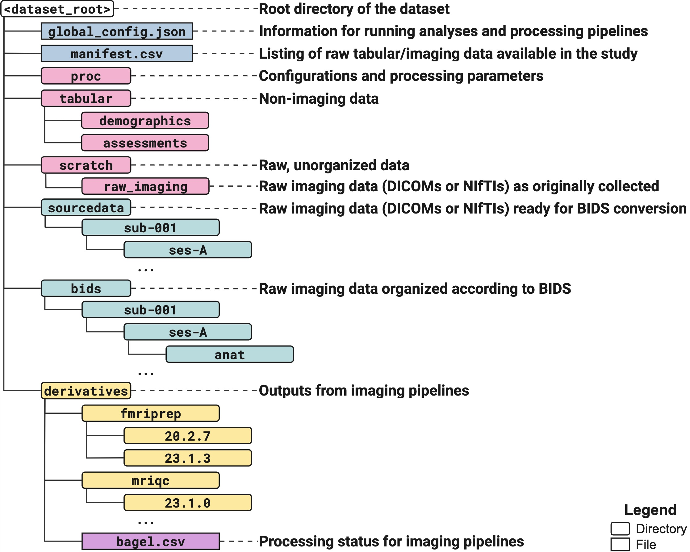

# Nipoppy

Nipoppy is a lightweight framework for standardized organization and processing of neuroimaging-clinical datasets. Its goal is to help users adopt the
[FAIR](https://www.go-fair.org/fair-principles/) principles
and improve the reproducibility of studies.

The framework includes three components:

1. A specification for dataset organization that extends the [Brain Imaging Data Structure (BIDS) standard](https://bids.neuroimaging.io/) by providing additional guidelines for tabular (e.g., phenotypic) data and imaging derivatives.

    

2. A protocol for data organization, curation and processing, with steps that include the following:
    - **Organization** of raw data, including conversion of raw DICOMs (or NIfTIs) to [BIDS](https://bids.neuroimaging.io/)
    - **Processing** of imaging data with existing or custom pipelines
    - **Tracking** of data availability and processing status
    - **Extraction** of imaging-derived phenotypes (IDPs) for downstream statistical modelling and analysis

    

3. A **command-line interface** and **Python package** that provide user-friendly tools for applying the framework. The tools build upon existing technologies such as the [Apptainer container platform](https://apptainer.org/) and the [Boutiques descriptor framework](https://boutiques.github.io/). Several existing containerized pipelines are supported out-of-the-box, and new pipelines can be added easily by the user.
    - We have also developed a [**web dashboard**](https://digest.neurobagel.org) for interactive visualizations of imaging and phenotypic data availability.

See the [documentation website](https://neurobagel.org/nipoppy/overview/) for more information!
