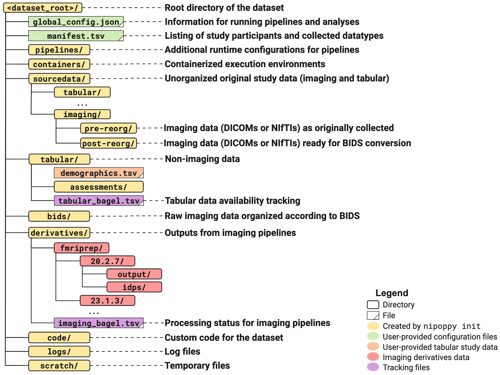

# Study specification

Nipoppy provides a specification (i.e. directory layout) for dataset organization that extends the [Brain Imaging Data Structure (BIDS) standard](https://bids.neuroimaging.io/). One can think of this as a "standard" for organizing data generated during a lifecycle of a study which may include sourcedata (e.g. DICOMs), tabular data (e.g., phenotypic assessments), and imaging derivatives (e.g. fMRIPrep output), in addition to the raw BIDS data. A study-level standardized directory layout simplifies curation and processing tasks as well as tracking of outputs. Additionally, the layout consists of directories to store pipeline specifications and custom code used for data processing and wrangling tasks. The complete layout configuration details are provided [here](../schemas/index.rst).

There are ongoing efforts to merge this specification with the BIDS standard's study-level dataset type.

The directory tree shown below is generated automatically upon dataset initialization (see [`nipoppy init`](../cli_reference/init.rst)).

