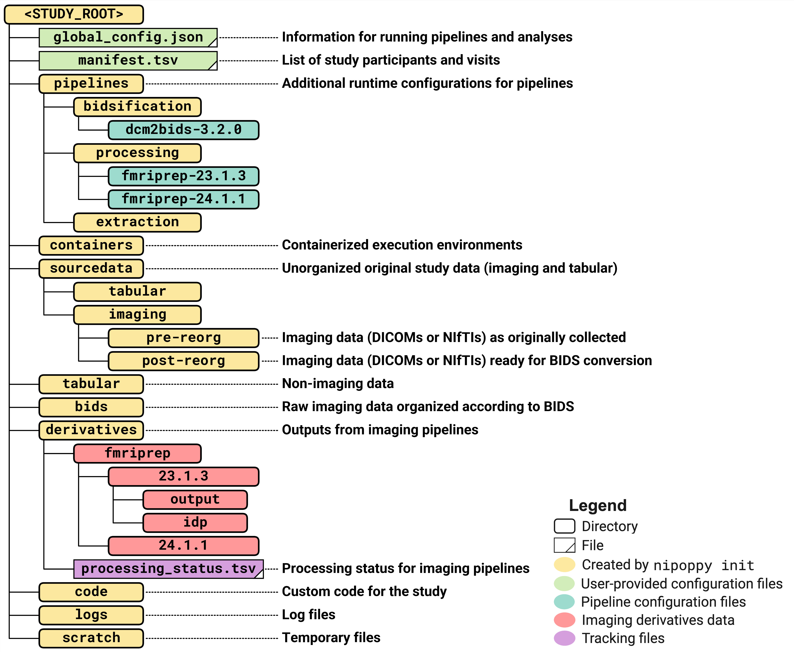

# Study specification

Nipoppy provides a specification (i.e. directory layout) for dataset organization that extends the [Brain Imaging Data Structure (BIDS) standard](https://bids.neuroimaging.io/). One can think of this as a "standard" for organizing data belonging to a `study` that supports tabular (e.g., phenotypic) data and imaging derivatives. A standardized directory layout simplifies invocation of processing pipelines and tracking of outputs.

There are on-going efforts to merge this specification as a `study`-level dataset type into the BIDS standard.

The directory tree shown below is generated automatically upon dataset initialization (see [nipoppy init](../how_to_guides/init/index.md)).

