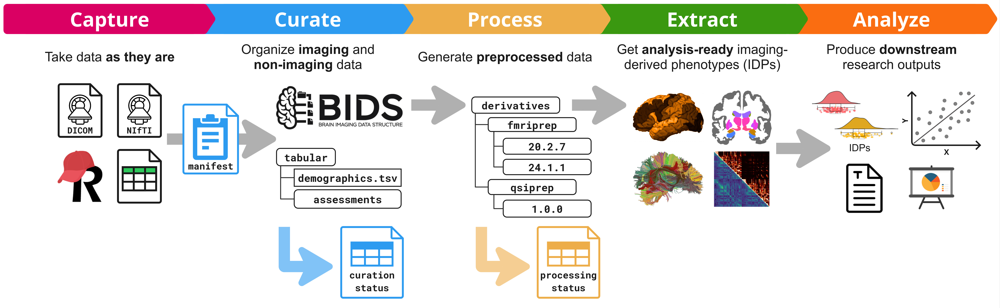

# Welcome to the Nipoppy documentation website!

Nipoppy is a lightweight framework for standardized organization and processing of neuroimaging-clinical datasets. Its goal is to help users adopt the [FAIR](https://www.go-fair.org/fair-principles/) principles and improve the reproducibility of studies.




The framework includes three components:

1. A **protocol** for data _wrangling_ to standardize generation of analysis-ready datasets

2. A **specification** for dataset organization that extends the [Brain Imaging Data Structure (BIDS) standard](https://bids.neuroimaging.io/)

3. A **command-line interface** and **Python package** that provide user-friendly tools for applying the framework

## Next steps

::::{grid} 3
:::{grid-item-card}  [Why Nipoppy](overview/why_nipoppy/index.md)
The motivation behind creating Nipoppy
:::
:::{grid-item-card}  [Installation](overview/installation)
Instructions to set up Nipoppy package
:::
:::{grid-item-card}  [Quickstart](overview/quickstart/index.md)
A user guide to get started
:::
::::


```{toctree}
---
hidden:
includehidden:
titlesonly:
caption: Overview
---
overview/why_nipoppy/index
overview/installation
overview/quickstart/index
```

```{toctree}
---
hidden:
includehidden:
titlesonly:
caption: Tutorials
---
tutorials/mriqc_from_bids/index
tutorials/integrations/index
tutorials/videos/index
```

```{toctree}
---
hidden:
includehidden:
titlesonly:
caption: Explanations
---
explanations/manifest
```

```{toctree}
---
hidden:
includehidden:
titlesonly:
caption: How-to guides
---
how_to_guides/user_guide/index
how_to_guides/init/index
how_to_guides/manifest/index
how_to_guides/tabular_data/index
how_to_guides/pipeline_install/index
how_to_guides/pipeline_run/index
how_to_guides/tracking/index
how_to_guides/parallelization/index
how_to_guides/pipeline_create/index
```


```{toctree}
---
hidden:
includehidden:
titlesonly:
caption: Reference
---
cli_reference/index
autoapi/index
schemas/index
```

```{toctree}
---
hidden:
includehidden:
titlesonly:
caption: Other
---
changelog
contributing
glossary
```
