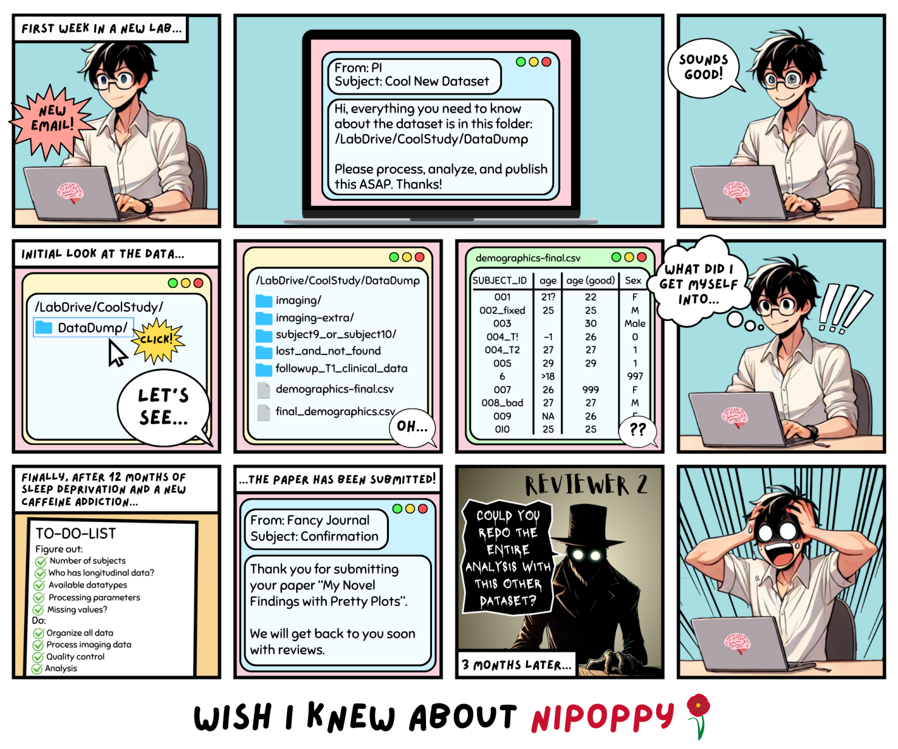

# Why Nipoppy?

*This is why Nipoppy was created.*



It is a result of data-wrangling PTSD from our own experiences as data managers and researchers. Nipoppy helps researchers to translate FAIR principles into practice by providing a step-by-step protocol together with a specification and Python package to navigate the steps of data curation, processing, tracking, and more!

If the data-wrangling is hard enough for a single dataset, imagine coordinating these efforts to ensure consistent data curation and processing across multiple datasets! Even when the data are in [BIDS](https://bids.neuroimaging.io/) (bless the standard and its maintainers), there are a number of questions that a full study processing adventure needs to address.

Given the heterogeneity in data, tools, and usage practices, we don’t think there is one technical solution that fits all. Thus, Nipoppy tries to engage with the users to show and instill best-practices that would empower them to make better decisions for their custom research workflows. We hope to proliferate [FAIR](https://www.go-fair.org/fair-principles/) datasets in the global community - neuroimaging and beyond - striving towards more open, reproducible, and translational neuroscience research.

*Or you can just use it to sleep better after a day of data-wrangling…*

```{toctree}
---
hidden:
includehidden:
---
The use cases<use_cases>
The principles<principles>
```

::::{grid} 2
:::{grid-item-card}  [The use cases](use_cases)
The practical use cases for various users
:::
:::{grid-item-card}  [The principles](principles)
The inspirations and design principles
:::
::::
