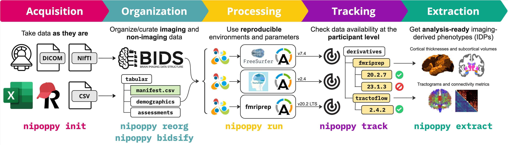

# Quickstart

```{note}
See the [Installation instructions](#installation) first if you have not yet installed Nipoppy.
```

% TODO add note about starting from BIDS dataset once nipoppy import is implemented, maybe point to a tutorial page instead of cluttering the quickstart guide

## Initializing a new dataset

An empty directory tree can be generated by running [`nipoppy init`](#cli_reference/init) (replacing `<PATH_TO_DATASET_ROOT>` with the appropriate path):

```{code-block} console
$ nipoppy init --dataset-root <PATH_TO_DATASET_ROOT>
```

```{warning}
There must not be anything already existing at `<PATH_TO_DATASET_ROOT>`, or the command will result in an error.
```

The newly created directory tree follows the Nipoppy specification. Other Nipoppy commands expect all these directories to exist -- they will throw an error if that is not the case.

```{tip}
Each subdirectory contains a `README.md` file that briefly describes the purpose of the subdirectory and the type of data that it should contain.
```

## Creating/modifying required files

Nipoppy requires two user-provided files in each dataset: a **{term}`JSON` configuration file** and a **tabular manifest file**. Commands will result in errors if either of these files does not exist or are invalid.

```{note}
The [`nipoppy init`](#cli_reference/init) command copies examples of these files to the expected paths within a new dataset, but you will most likely have to modify/overwrite them.
```

(customizing-config)=
### Customizing the configuration file

The configuration file at {{fpath_config}} contains general information about a dataset (e.g. name, visit and session names) and configurations for running processing pipelines (e.g., pipeline version and runtime parameters).

The example config file contains configurations for all BIDS conversion and image processing software that are supported out-of-the-box by Nipoppy. You should replace the placeholder strings/substrings (e.g. `<DATASET_NAME>`) by more appropriate values for your dataset. See dropdown below (lines that should be changed are highlighted).

You can also delete (or not) any configuration for a software/version that you do not plan to use.

````{admonition} The example config file
---
class: dropdown
---
Here is the default content of {{fpath_config}}:
```{literalinclude} ../../nipoppy/data/examples/sample_global_configs.json
---
linenos: True
emphasize-lines: 2, 4, 7, 28, 35, 51, 56, 69, 82, 91, 104
language: json
---
```
````

% TODO point to config pages for detailed guide once those are written

```{tip}
See the {ref}`schema reference <config-schema>` for more information about each config field.
```

### Generating the manifest file

The manifest file at {{fpath_manifest}} contains *ground truth* information about the participants and visits/sessions available for a dataset.

There must be only **one row** per unique participant/visit combination.

The example manifest looks like this:
```{csv-table}
---
file: ../../nipoppy/data/examples/sample_manifest.csv
header-rows: 1
---
```

````{admonition} Raw content of the example manifest file
---
class: dropdown
---
```{literalinclude} ../../nipoppy/data/examples/sample_manifest.csv
---
linenos: True
language: csv
---
```
````

It is extremely unlikely that this manifest file works for your dataset, so you will have to generate one yourself. We recommend writing a script, for the purpose of reproducibility and easy updates if the more data is added to the dataset.


% TODO point to example script for generating a manifest

```{tip}
See the {ref}`schema reference <manifest-schema>` for more information about each column.
```

## Next steps

The rest of this documentation is still work in progress. At a starting point, refer to the [commands](cli_reference/index) associated with the data organization or processing step(s) you wish to perform.



% TODO point to tutorials once they are created (running BIDS conversion, running a pipeline)

% TODO mention that all other commands create log files in scratch/logs (?)
